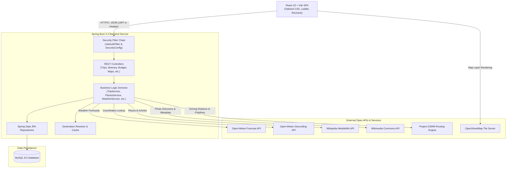

# Voyago

Voyago is a full-stack, production-ready travel planning and itinerary management platform engineered to streamline the entire travel lifecycle. Built with a Spring Boot 3 Java backend, a React 19 single-page application frontend, and a MySQL relational database, Voyago empowers travelers to create and manage multi-day trips, organize day-by-day itineraries, explore curated destinations and local attractions with verified Wikimedia imagery, monitor real-time weather forecasts, calculate driving routes on interactive OpenStreetMap maps, track multi-currency budgets and expenses, manage categorized packing checklists, receive automated trip alerts, and securely share read-only trip overviews through cryptographically secure shareable links.

---

## Live Demo

| Service | Live URL | Description |
| :--- | :--- | :--- |
| **Frontend Application** | [https://beautiful-perfection-production-09e2.up.railway.app](https://beautiful-perfection-production-09e2.up.railway.app) | Single-page web application (React + Vite) |
| **Backend REST API** | [https://voyago-production-a8e6.up.railway.app](https://voyago-production-a8e6.up.railway.app) | Spring Boot REST API service |

---

## Features

### Core Trip Planning & Management
- **Trip Lifecycle Management**: Create, view, update, and delete trips with destination names, start/end dates, duration calculations, and personal travel notes.
- **Interactive Day-by-Day Itinerary**: Organize scheduled activities with dates, times, locations, and descriptive notes ordered chronologically.
- **Search, Filtering & Sorting**: Filter trips by status (upcoming, ongoing, completed), search itineraries and expenses by keyword, and sort trips by departure date.
- **Print & Export to PDF**: Clean, print-optimized trip summary view formatted for direct printing or "Save as PDF" for offline travel reference.

### Destination Intelligence & Discovery
- **Destination Catalog & Resolver**: Built-in comprehensive destination catalog covering Karnataka districts and major travel hubs with geographic coordinates and metadata.
- **Real-Time Autocomplete**: Fast debounced destination search assisting users with instant query matching.
- **Places & Attractions Discovery**: Automatic discovery of popular attractions, landmarks, museums, and natural sites using the Wikipedia MediaWiki API.
- **Wikimedia Commons Image Fallback**: Multi-tier photo resolution with title/category relevance scoring and GPS distance validation (rejecting images >30 km away) to guarantee accurate imagery.

### Maps, Routing & Weather
- **Interactive OpenStreetMap Maps**: Embedded Leaflet maps displaying destination centers, itinerary activity pins, and nearby attractions.
- **Turn-by-Turn Driving Routes**: Dynamic route calculations, polyline drawing, distance in kilometers, and estimated drive durations powered by the OSRM routing engine.
- **7-Day Weather Forecasts**: Real-time temperature, weather condition codes, precipitation forecasts, wind speeds, and 7-day outlooks via Open-Meteo API.

### Financials & Packing Management
- **Budget & Expense Tracking**: Set planned budgets per trip with multi-currency support (INR, USD, EUR, GBP, etc.) and log categorized expenses (Accommodation, Food, Transport, Activities, Shopping, Miscellaneous) with payment method tags.
- **Visual Analytics**: Interactive Recharts visualizations displaying budget utilization vs. remaining balance and category expense breakdowns.
- **Categorized Packing Checklists**: Manage packing items by category (Clothing, Toiletries, Electronics, Documents, Essentials), toggle packed status, and monitor completion progress bars.

### Collaboration & Notifications
- **Public Trip Sharing**: Generate unique, cryptographically secure 256-bit share tokens providing guests with a public read-only view of itineraries, packing summaries, and budgets without exposing user credentials.
- **Automated Trip Notifications**: Background event evaluation generating contextual alerts for upcoming trip reminders (7 days prior), trip departure day alerts, daily itinerary activity summaries, and budget overspend warnings.
- **Notification Center**: Real-time unread badge counter, mark-as-read toggles, batch "mark all as read", and notification deletion.

---

## Technology Stack

### Backend
- **Language**: Java 17
- **Framework**: Spring Boot 3.2.4
- **Security**: Spring Security 6, Stateless JWT (`io.jsonwebtoken` JJWT 0.11.5), BCrypt password hashing
- **Data & Persistence**: Spring Data JPA, Hibernate ORM, MySQL Connector/J
- **Database**: MySQL 8.0+
- **Validation**: Jakarta Bean Validation (`hibernate-validator`)
- **Build & Dependency Management**: Apache Maven 3.8+

### Frontend
- **Language & Runtime**: JavaScript (ES Modules), Node.js
- **UI Library**: React 19.2
- **Build Tool**: Vite 8.2
- **Styling**: Tailwind CSS 4.3, PostCSS, Vanilla CSS design system
- **Routing**: React Router DOM 7.18
- **HTTP Client**: Axios 1.20 (configured with JWT interceptors)
- **Mapping & Geospatial**: Leaflet 1.9, React-Leaflet 5.0
- **Data Visualization**: Recharts 3.10
- **Icons**: Lucide React 1.34
- **Linter**: Oxlint 1.79

---

## Architecture

Voyago is architected as a decoupled client-server web application adhering to RESTful design principles and stateless authentication.



---

## Project Structure

```text
voyago/
├── voyago-backend/                  # Spring Boot Java application
│   ├── src/
│   │   ├── main/
│   │   │   ├── java/com/voyago/backend/
│   │   │   │   ├── config/          # CORS, Jackson, and MVC configuration
│   │   │   │   ├── controller/      # REST API controllers
│   │   │   │   ├── dto/             # Data Transfer Objects (requests/responses)
│   │   │   │   ├── entity/          # JPA entity models
│   │   │   │   ├── exception/       # Global exception handler & custom exceptions
│   │   │   │   ├── integration/     # External API clients (Open-Meteo, OSRM, MediaWiki)
│   │   │   │   ├── repository/      # Spring Data JPA repositories
│   │   │   │   ├── security/        # JWT filter, UserDetailsService, SecurityConfig
│   │   │   │   ├── service/         # Business services & destination resolver
│   │   │   │   └── util/            # Helper utilities
│   │   │   └── resources/
│   │   │       ├── application.properties # Spring application configuration
│   │   │       └── destinations.json      # Built-in Karnataka destination dataset
│   │   └── test/java/com/voyago/backend/  # Automated unit, integration & regression tests
│   └── pom.xml                      # Maven build configuration
│
├── voyago-frontend/                 # React + Vite frontend application
│   ├── src/
│   │   ├── assets/                  # Static assets & SVG icons
│   │   ├── components/              # Modular UI components (Navbar, Sections, Modals)
│   │   ├── context/                 # React Context (AuthContext)
│   │   ├── hooks/                   # Custom React hooks
│   │   ├── layouts/                 # Page layout wrappers
│   │   ├── pages/                   # Top-level route pages (Home, Dashboard, Print, Public)
│   │   ├── routes/                  # ProtectedRoute and PublicRoute guards
│   │   ├── services/                # Axios API service modules
│   │   ├── App.jsx                  # Main application router
│   │   ├── index.css                # Global Tailwind CSS and design styles
│   │   └── main.jsx                 # Application entry point
│   ├── index.html                   # HTML entry point
│   ├── package.json                 # Frontend dependencies and scripts
│   └── vite.config.js               # Vite bundler configuration
│
├── .gitignore                       # Git ignore rules for Maven, Node, and environment files
├── DEPLOYMENT.md                    # Detailed production deployment guide
└── README.md                        # Project documentation
```

---

## Backend API Overview

All backend endpoints (except public authentication, destinations, and public trip share routes) require an `Authorization: Bearer <JWT>` header.

### Authentication (`/api/auth`)
| Method | Endpoint | Description | Auth Required |
| :--- | :--- | :--- | :---: |
| `POST` | `/api/auth/register` | Register a new user account | No |
| `POST` | `/api/auth/login` | Authenticate user and receive JWT token | No |

### Destinations (`/api/destinations`)
| Method | Endpoint | Description | Auth Required |
| :--- | :--- | :--- | :---: |
| `GET` | `/api/destinations/search?query={q}&limit={n}` | Search destinations with autocomplete | No |
| `GET` | `/api/destinations/karnataka` | List curated Karnataka destinations (filter by district/category) | No |
| `GET` | `/api/destinations/{id}` | Get specific destination metadata | No |

### Trips (`/api/trips`)
| Method | Endpoint | Description | Auth Required |
| :--- | :--- | :--- | :---: |
| `GET` | `/api/trips` | Get all trips owned by authenticated user | Yes |
| `POST` | `/api/trips` | Create a new trip | Yes |
| `GET` | `/api/trips/{id}` | Get details of a specific owned trip | Yes |
| `PUT` | `/api/trips/{id}` | Update trip title, destination, dates, or notes | Yes |
| `DELETE` | `/api/trips/{id}` | Delete a trip and associated sub-resources | Yes |

### Itinerary Items (`/api/trips/{tripId}/itinerary`)
| Method | Endpoint | Description | Auth Required |
| :--- | :--- | :--- | :---: |
| `GET` | `/api/trips/{tripId}/itinerary` | Get all itinerary activities for a trip | Yes |
| `POST` | `/api/trips/{tripId}/itinerary` | Add a new itinerary activity | Yes |
| `GET` | `/api/trips/{tripId}/itinerary/{itemId}` | Get a single itinerary item | Yes |
| `PUT` | `/api/trips/{tripId}/itinerary/{itemId}` | Update an existing itinerary activity | Yes |
| `DELETE` | `/api/trips/{tripId}/itinerary/{itemId}` | Remove an itinerary activity | Yes |

### Budget & Expenses (`/api/trips/{tripId}/budget` & `/api/trips/{tripId}/expenses`)
| Method | Endpoint | Description | Auth Required |
| :--- | :--- | :--- | :---: |
| `GET` | `/api/trips/{tripId}/budget` | Get trip budget allocation | Yes |
| `POST` | `/api/trips/{tripId}/budget` | Set or initialize trip budget | Yes |
| `PUT` | `/api/trips/{tripId}/budget` | Update trip budget amount or currency | Yes |
| `DELETE` | `/api/trips/{tripId}/budget` | Reset trip budget | Yes |
| `GET` | `/api/trips/{tripId}/budget/summary` | Get aggregated budget vs total spent summary | Yes |
| `GET` | `/api/trips/{tripId}/expenses` | List all logged expenses for a trip | Yes |
| `POST` | `/api/trips/{tripId}/expenses` | Log a new expense | Yes |
| `PUT` | `/api/trips/{tripId}/expenses/{expenseId}` | Update an expense record | Yes |
| `DELETE` | `/api/trips/{tripId}/expenses/{expenseId}` | Delete an expense record | Yes |

### Packing Checklist (`/api/trips/{tripId}/packing-items`)
| Method | Endpoint | Description | Auth Required |
| :--- | :--- | :--- | :---: |
| `GET` | `/api/trips/{tripId}/packing-items` | Get packing items for a trip | Yes |
| `POST` | `/api/trips/{tripId}/packing-items` | Add a new packing item | Yes |
| `GET` | `/api/trips/{tripId}/packing-items/summary` | Get total, packed, unpacked count & progress % | Yes |
| `PATCH` | `/api/trips/{tripId}/packing-items/{itemId}/toggle` | Toggle item packed/unpacked status | Yes |
| `PUT` | `/api/trips/{tripId}/packing-items/{itemId}` | Update packing item details | Yes |
| `DELETE` | `/api/trips/{tripId}/packing-items/{itemId}` | Remove a packing item | Yes |

### Places & Attractions (`/api/places`)
| Method | Endpoint | Description | Auth Required |
| :--- | :--- | :--- | :---: |
| `GET` | `/api/places?destination={destination}` | Discover attractions with verified Wikimedia images | Yes |

### Maps & Routing (`/api/maps`)
| Method | Endpoint | Description | Auth Required |
| :--- | :--- | :--- | :---: |
| `GET` | `/api/maps?destination={destination}` | Get destination center coordinates | Yes |
| `GET` | `/api/maps/places?destination={destination}` | Get attraction coordinates for map markers | Yes |
| `GET` | `/api/maps/route?startLat={lat}&startLng={lng}&endLat={lat}&endLng={lng}` | Calculate OSRM driving route & polyline | Yes |

### Weather Forecast (`/api/weather`)
| Method | Endpoint | Description | Auth Required |
| :--- | :--- | :--- | :---: |
| `GET` | `/api/weather?destination={destination}` | Fetch current conditions & 7-day forecast | Yes |

### Notifications & Reminders (`/api/notifications`)
| Method | Endpoint | Description | Auth Required |
| :--- | :--- | :--- | :---: |
| `GET` | `/api/notifications` | Get notifications for authenticated user | Yes |
| `GET` | `/api/notifications/unread-count` | Get total count of unread notifications | Yes |
| `PATCH` | `/api/notifications/{id}/read` | Mark single notification as read | Yes |
| `PATCH` | `/api/notifications/read-all` | Mark all notifications as read | Yes |
| `DELETE` | `/api/notifications/{id}` | Delete a notification | Yes |
| `POST` | `/api/notifications/generate` | Trigger on-demand evaluation of trip reminders | Yes |

### Trip Sharing (`/api/trips/{tripId}/share` & `/api/shared/trips/{shareToken}`)
| Method | Endpoint | Description | Auth Required |
| :--- | :--- | :--- | :---: |
| `POST` | `/api/trips/{tripId}/share` | Generate or retrieve active share token for owned trip | Yes |
| `GET` | `/api/trips/{tripId}/share` | View share status of owned trip | Yes |
| `DELETE` | `/api/trips/{tripId}/share` | Revoke active share token | Yes |
| `GET` | `/api/shared/trips/{shareToken}` | View public read-only trip overview | No |

---

## Security Architecture

- **Stateless JWT Authentication**: User credentials are submitted via `/api/auth/login`. Upon validation, a cryptographically signed HMAC-SHA256 JWT is issued with configurable expiration (default: 24 hours). Subsequent API requests pass this token in the `Authorization: Bearer <token>` header.
- **BCrypt Password Hashing**: User passwords are encrypted with BCrypt prior to database persistence and are never returned in DTOs or log files.
- **Strict User Isolation & Ownership Verification**: All data modification and retrieval queries enforce tenant isolation via `findByUserId` or `findByIdAndUserId`, ensuring User A cannot read, modify, or delete records belonging to User B.
- **Cryptographic Public Sharing**: Public share links use 256-bit cryptographically secure random tokens (`SecureRandom` + Base64Url). The public endpoint returns a sanitized `PublicTripResponse` that excludes user identifiers, emails, passwords, and write operations.
- **Sanitized Global Error Handling**: The `GlobalExceptionHandler` intercepts exceptions and standardizes HTTP 400, 401, 404 (`NoResourceFoundException`), and 500 error formats (`{"timestamp", "status", "message"}`) without exposing internal stack traces or database structures.
- **Security Headers & CORS**: Configured with `X-Frame-Options: DENY`, `X-Content-Type-Options: nosniff`, and a dynamic CORS origin whitelist supporting production domains and local development.

---

## Database Design

Voyago uses a MySQL 8 relational schema with foreign key integrity and indexes on frequently queried lookup columns.

```text
+-------------------+       1:N       +-------------------+       1:N       +-------------------+
|      users        | <-------------> |       trips       | <-------------> |  itinerary_items  |
|-------------------|                 |-------------------|                 |-------------------|
| id (PK)           |                 | id (PK)           |                 | id (PK)           |
| email (Unique)    |                 | user_id (FK)      |                 | trip_id (FK)      |
| name              |                 | title             |                 | title             |
| password (Hashed) |                 | destination       |                 | description       |
| role              |                 | start_date        |                 | date              |
| verified          |                 | end_date          |                 | time              |
| created_at        |                 | notes             |                 | location          |
+-------------------+                 +-------------------+                 +-------------------+
         |                                      |
         | 1:N                                  | 1:1
         v                                      v
+-------------------+                 +-------------------+
|   notifications   |                 |   trip_budgets    |
|-------------------|                 |-------------------|
| id (PK)           |                 | id (PK)           |
| user_id (FK)      |                 | trip_id (FK)      |
| trip_id (FK, Null)|                 | total_budget      |
| type (Enum)       |                 | currency          |
| title             |                 +-------------------+
| message           |                           |
| is_read           |                           | 1:N
| created_at        |                           v
+-------------------+                 +-------------------+
         |                            |     expenses      |
         | 1:N                        |-------------------|
         |                            | id (PK)           |
         v                            | trip_id (FK)      |
+-------------------+                 | category (Enum)   |
|   trip_shares     |                 | amount            |
|-------------------|                 | description       |
| id (PK)           |                 | expense_date      |
| trip_id (FK)      |                 | payment_method    |
| share_token (Idx) |                 +-------------------+
| active            |                           |
| created_at        |                           | 1:N
+-------------------+                           v
                                      +-------------------+
                                      |   packing_items   |
                                      |-------------------|
                                      | id (PK)           |
                                      | trip_id (FK)      |
                                      | item_name         |
                                      | category (Enum)   |
                                      | quantity          |
                                      | is_packed         |
                                      | notes             |
                                      +-------------------+
```

---

## External Services & Integrations

| Provider / API | Purpose in Voyago | Authentication / Licensing |
| :--- | :--- | :--- |
| **Open-Meteo Weather Forecast API** | Provides temperature, weather condition codes, and 7-day meteorological forecasts for destination coordinates. | Free open-access API / Non-commercial attribution |
| **Open-Meteo Geocoding API** | Converts destination and landmark text queries into geographic coordinates (Latitude, Longitude). | Free open-access API |
| **Wikipedia MediaWiki API** | Queries localized landmark descriptions and extracts tourist attractions for target destinations. | Free open-access API (Creative Commons) |
| **Wikimedia Commons API** | Searches open-license photographic thumbnails for attractions with GPS distance validation. | Free open-access API (Creative Commons) |
| **Project-OSRM Routing Service** | Computes road driving routes, turn geometry, distances, and drive durations between coordinates. | Free open-source routing API |
| **OpenStreetMap & Leaflet** | Renders interactive raster map layers and custom location pins on the client application. | Open Data Commons (ODbL) |

---

## Testing & Quality Assurance

The Voyago backend includes a comprehensive automated test suite testing units, controller endpoints, JPA queries, and end-to-end regression workflows.

### Verified Test Results

```text
Backend Automated Tests:
  Tests Run:     154
  Passed:        154
  Failures:        0
  Errors:          0
  Skipped:         0
  Build Status:  SUCCESS (Total time: ~3m 16s)

Frontend Verification:
  Vite Build:    SUCCESS (0 errors, 2,530 modules transformed)
  Linter:        SUCCESS (0 errors, Oxlint clean)
```

### Test Coverage Areas
1. **Authentication & Security**: Login, registration, token generation, password encryption, security headers (`X-Frame-Options`), and unmapped endpoint handling (`NoResourceFoundException` -> HTTP 404).
2. **User Isolation & Ownership**: Cross-user mutation rejection across Trips, Budgets, Itinerary, Expenses, Packing Lists, and Notifications.
3. **Trip Management**: Date validation (end date cannot precede start date), CRUD persistence, and cascading operations.
4. **Calculations**: Expense summation, multi-currency balance calculation, and packing checklist completion percentages.
5. **Places & Image Resolution**: MediaWiki parsing, photo fallback relevance scoring, and GPS coordinate distance filtering (>30 km rejection).
6. **Notifications & Reminders**: Automated notification generation (Trip Starting, Trip Started, Today's Itinerary, Budget Exceeded) and deduplication logic.

---

## Deployment Architecture

Voyago is configured for containerized continuous deployment on the [Railway](https://railway.com/) platform directly integrated with GitHub.

```text
GitHub (main branch push)
       │
       ├─────────────────────────────────┐
       ▼                                 ▼
Railway Backend Service           Railway Frontend Service
(Spring Boot 3 JAR on Port 8080)   (Vite Static Build / Dist)
       │                                 │
       ▼ Private Network                 │ HTTPS (CORS Allowed)
Railway MySQL 8 Database                 └───────────────────────▶ Browser Client
```

### Production Environment Configuration

The backend consumes configuration parameters through environment variables:

| Environment Variable | Description | Example / Production Placeholder |
| :--- | :--- | :--- |
| `PORT` | Web server port assigned by host | `8080` (or host-injected `$PORT`) |
| `DB_URL` | JDBC connection string | `jdbc:mysql://${MYSQLHOST}:${MYSQLPORT}/${MYSQLDATABASE}?useSSL=true` |
| `DB_USERNAME` | Database username | `${MYSQLUSER}` |
| `DB_PASSWORD` | Database password | `${MYSQLPASSWORD}` |
| `JWT_SECRET` | 256-bit secret key for HMAC-SHA256 | `your_secure_256_bit_random_secret_key` |
| `JWT_EXPIRATION` | Token time-to-live in milliseconds | `86400000` (24 Hours) |
| `FRONTEND_URL` | CORS allowed origin(s) | `https://beautiful-perfection-production-09e2.up.railway.app` |

---

## Local Development Setup

### Prerequisites
- **Java**: OpenJDK 17 or higher
- **Maven**: Apache Maven 3.8+ (or Maven Wrapper)
- **Node.js**: Node.js 18+ (Node 20+ LTS recommended) & npm
- **Database**: MySQL Server 8.0+ running locally on port 3306

---

### Step 1: Clone the Repository
```bash
git clone https://github.com/sreedhargowda1204-ctrl/voyago.git
cd voyago
```

---

### Step 2: Configure & Start the MySQL Database
Create a local database in MySQL:
```sql
CREATE DATABASE IF NOT EXISTS voyago_db;
```

---

### Step 3: Configure & Run the Backend

Navigate to `voyago-backend` and run:

```bash
cd voyago-backend

# Set environment variables (or rely on application.properties defaults)
export DB_URL="jdbc:mysql://localhost:3306/voyago_db"
export DB_USERNAME="root"
export DB_PASSWORD="your_mysql_password"
export JWT_SECRET="404E635266556A586E3272357538782F413F4428472B4B6250645367566B5970"
export FRONTEND_URL="http://localhost:5173"

# Run automated tests
mvn clean test

# Start the Spring Boot backend
mvn spring-boot:run
```
The backend REST API will be available at `http://localhost:8080`.

---

### Step 4: Configure & Run the Frontend

In a new terminal window:

```bash
cd voyago-frontend

# Install dependencies
npm install

# Start the Vite development server
npm run dev
```
The frontend application will be running at `http://localhost:5173`.

---

## Production URLs

- **Frontend Application**: [https://beautiful-perfection-production-09e2.up.railway.app](https://beautiful-perfection-production-09e2.up.railway.app)
- **Backend Service**: [https://voyago-production-a8e6.up.railway.app](https://voyago-production-a8e6.up.railway.app)

---

## Screenshots

> *Application screenshots and interface walkthroughs will be added in this section.*

To add screenshots, capture full-resolution views of the key interfaces and place them in `docs/screenshots/`:
- `01-dashboard.png` — Trip Overview & Status Badges
- `02-itinerary.png` — Interactive Timeline & Activities
- `03-map-routing.png` — OpenStreetMap & OSRM Driving Routes
- `04-budget-analytics.png` — Financial Chart Breakdown & Expense Log
- `05-public-share.png` — Read-Only Shared Trip View

---

## Future Enhancements

The following features and optimizations represent potential future development items:
- **Vite Vendor Code-Splitting**: Optimize production bundle delivery by chunking heavy mapping and charting libraries.
- **Expanded Global Destination Catalogs**: Extend built-in catalog coverage beyond Karnataka to international travel hubs.
- **Multi-Modal Transit Integration**: Add support for rail, bus, and flight schedule search.
- **Offline Progressive Web App (PWA)**: Implement service worker caching for offline itinerary access on mobile devices.

---

## Notes & Disclaimers

- External data such as real-time weather forecasts, destination landmarks, and routing information relies on third-party open-access APIs (Open-Meteo, Wikipedia MediaWiki, Wikimedia Commons, Project-OSRM). Service availability depends on network connectivity and upstream API uptime.
- Images sourced from Wikimedia Commons are subject to their respective Creative Commons and public domain licenses.

---

## License

License: Not currently specified.
